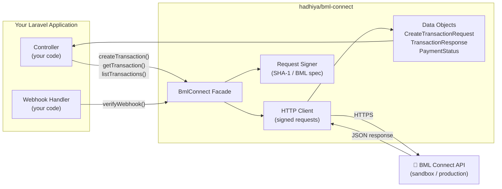
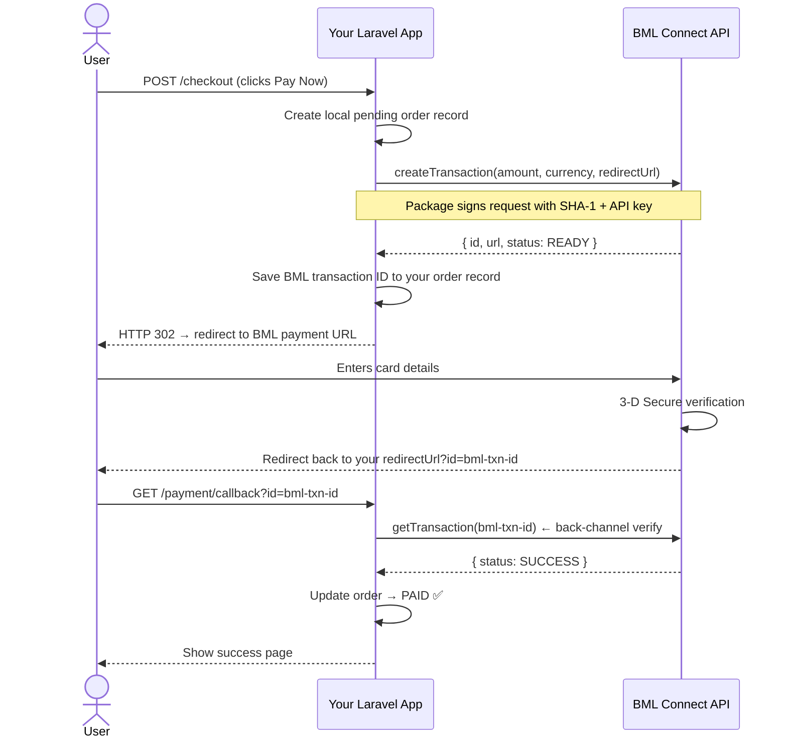
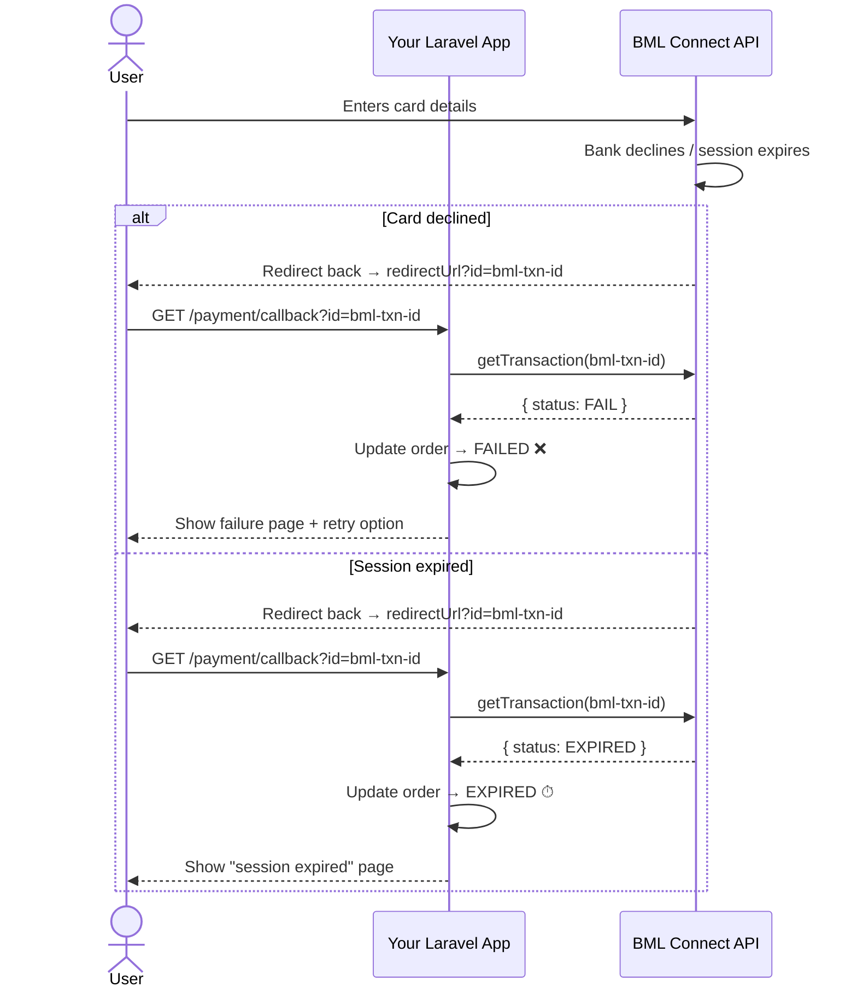
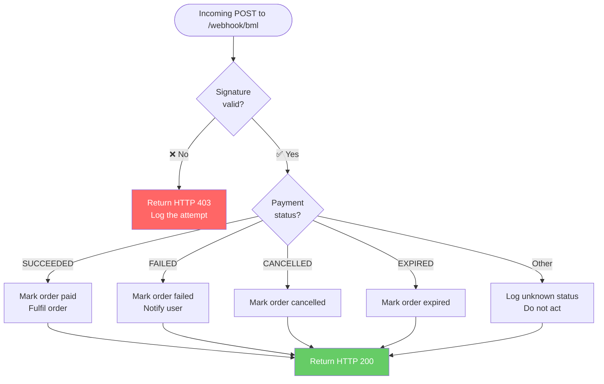
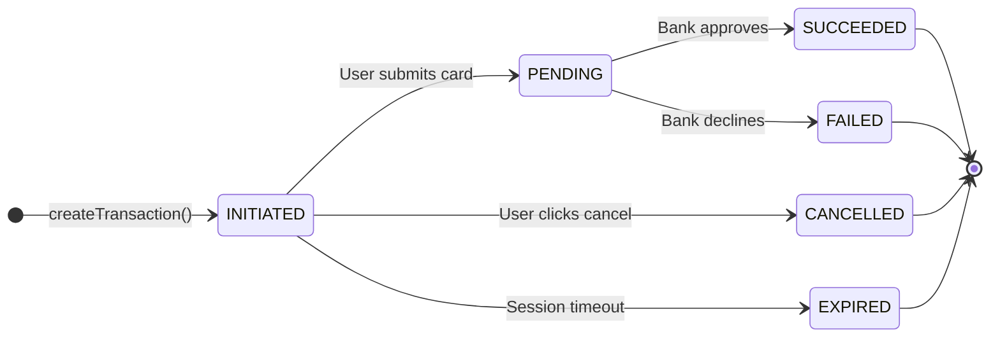
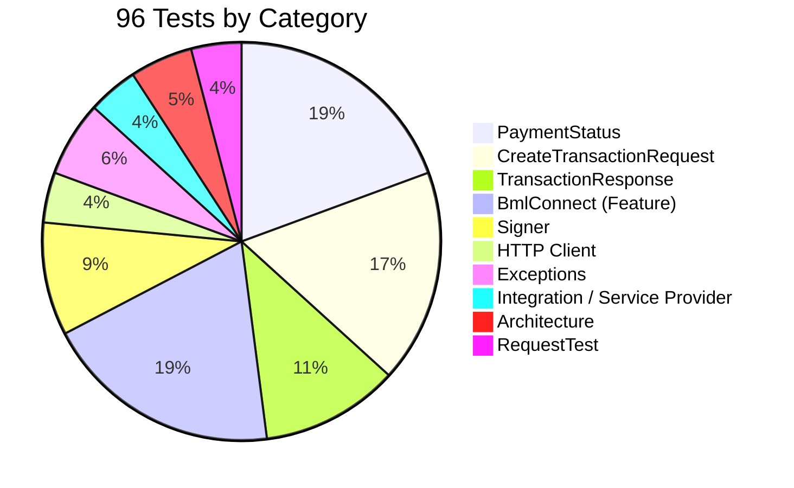

# BML Connect Laravel Gateway Adapter

[](https://packagist.org/packages/hadhiya/bml-connect)
[](https://github.com/hadhiya/bml-connect/actions/workflows/run-tests.yml)
[](https://packagist.org/packages/hadhiya/bml-connect)
[](https://packagist.org/packages/hadhiya/bml-connect)

A secure, testable Laravel gateway adapter for **Bank of Maldives (BML) Connect**. Handles request signing, HTTP communication, response normalisation, and webhook verification — so your application can focus on business logic.

---

## What This Package Does (and Doesn't Do)

| ✅ This package handles | ❌ This package does NOT handle |
|---|---|
| HTTP communication with the BML API | Storing transactions in your database |
| Signing requests with your API key | Queuing payment jobs |
| Normalising API responses into typed PHP objects | Sending email/SMS notifications |
| Verifying incoming webhook signatures | Routing, controllers, or middleware |
| Sandbox / production environment switching | Any UI or front-end |

> [!IMPORTANT]
> This is a **stateless adapter**. It is your application's responsibility to persist transaction records, track order status, and handle business logic. This package is the communication layer only.

---

## Architecture



---

## Payment Lifecycle

### ✅ Happy Path (Payment Succeeds)



### ❌ Failure Path (Payment Declined or Expired)



> [!WARNING]
> **Never trust the redirect alone.** A malicious user can visit your callback URL with any `?id=` value. Always call `getTransaction()` from your server (back-channel) to get the authoritative status from BML.

---

## Installation

**Requirements:** PHP 8.4+, Laravel 10 / 11 / 12

```bash
composer require hadhiya/bml-connect
```

Publish the configuration file:

```bash
php artisan vendor:publish --tag="bml-connect-config"
```

This creates `config/bml-connect.php` in your application.

---

## Configuration

Add the following to your `.env` file:

```env
BML_CONNECT_MODE=sandbox
BML_CONNECT_API_KEY=your-api-key-here
BML_CONNECT_APP_ID=your-app-id-here
```

| Variable | Description | Default | Required |
|---|---|---|---|
| `BML_CONNECT_MODE` | `sandbox` or `production` | `sandbox` | Yes |
| `BML_CONNECT_API_KEY` | Your BML Connect API key | — | Yes |
| `BML_CONNECT_APP_ID` | Your BML Connect application ID | — | Yes |

> [!CAUTION]
> **Never commit your API key to version control.** Always use environment variables. Rotate your key immediately if it is ever exposed.

The published config (`config/bml-connect.php`) also exposes timeout and retry settings:

```php
// config/bml-connect.php
return [
    'mode'    => env('BML_CONNECT_MODE', 'sandbox'),
    'api_key' => env('BML_CONNECT_API_KEY'),
    'app_id'  => env('BML_CONNECT_APP_ID'),

    'endpoints' => [
        'sandbox'    => 'https://api.uat.merchants.bankofmaldives.com.mv/public/',
        'production' => 'https://api.merchants.bankofmaldives.com.mv/public/',
    ],

    'timeout' => 30, // seconds — applies to all HTTP requests

    'retry' => [
        'times' => 3,   // only applies to GET (read) requests
        'sleep' => 100, // milliseconds between retries
    ],
];
```

> [!NOTE]
> Retry logic applies **only to read requests** (`getTransaction`, `listTransactions`). Transaction creation (`createTransaction`) never retries automatically — retrying a payment POST could cause duplicate charges.

---

## Step-by-Step Integration

### Step 1 — Create a Transaction

Use the `CreateTransactionRequest` DTO to build your request. The constructor validates your inputs immediately, before any network call is made.

```php
use Hadhiya\BmlConnect\Facades\BmlConnect;
use Hadhiya\BmlConnect\Data\CreateTransactionRequest;
use Hadhiya\BmlConnect\Exceptions\BmlException;

$request = new CreateTransactionRequest(
    amount:      5000,                          // MVR 50.00 — smallest unit (laari)
    currency:    'MVR',
    redirectUrl: route('payment.callback'),     // where BML sends the user back
    localId:     'order-' . $order->id,         // your internal reference
);

try {
    $transaction = BmlConnect::createTransaction($request);
} catch (BmlException $e) {
    // BML API returned an HTTP error (4xx / 5xx)
    Log::error('BML transaction creation failed', ['code' => $e->getCode()]);
    return back()->withErrors('Payment unavailable. Please try again.');
}

// Save $transaction->id to your order before redirecting!
$order->update(['bml_transaction_id' => $transaction->id]);

return redirect($transaction->url);
```

**`CreateTransactionRequest` validation rules:**

| Parameter | Type | Rules | Notes |
|---|---|---|---|
| `amount` | `int` | Required, must be > 0 | Smallest currency unit (laari for MVR) |
| `currency` | `string` | Required, not empty | Default: `MVR` |
| `redirectUrl` | `?string` | Must be a valid URL if provided | Where BML redirects the user after payment |
| `localId` | `?string` | Optional | Your internal order/invoice ID |
| `provider` | `?string` | Optional | Specific payment provider (if required) |

> [!WARNING]
> If any validation rule is violated, an `\InvalidArgumentException` is thrown **before** any API call. See the [Exception Reference](#exception-reference) for details.

---

### Step 2 — Handle the Payment Callback

BML redirects the user back to your `redirectUrl` with a `?id=` query parameter containing the BML transaction ID. **Always verify the status server-side.**

```php
use Hadhiya\BmlConnect\Facades\BmlConnect;
use Hadhiya\BmlConnect\Exceptions\BmlException;
use Illuminate\Http\Request;

public function callback(Request $request)
{
    $bmlId = $request->query('id');

    if (! $bmlId) {
        return redirect()->route('home')->withErrors('Invalid callback.');
    }

    // Retrieve your order using the BML ID you saved in Step 1
    $order = Order::where('bml_transaction_id', $bmlId)->firstOrFail();

    try {
        $transaction = BmlConnect::getTransaction($bmlId);
    } catch (BmlException $e) {
        Log::error('BML status check failed', ['bml_id' => $bmlId, 'code' => $e->getCode()]);
        return view('payment.error');
    }

    // Use the enum helpers to branch your logic cleanly
    if ($transaction->status->isSucceeded()) {
        $order->update(['status' => 'paid']);
        return view('payment.success', compact('order'));
    }

    if ($transaction->status->isFailed()) {
        $order->update(['status' => 'failed']);
        return view('payment.failed', compact('order'));
    }

    if ($transaction->status->requiresPolling()) {
        // Still processing — show a pending page and poll or wait for webhook
        return view('payment.pending', compact('order'));
    }

    // CANCELLED or EXPIRED
    $order->update(['status' => $transaction->status->value]);
    return view('payment.cancelled', compact('order'));
}
```

---

### Step 3 — Handle Webhooks

BML can send asynchronous status updates to a webhook endpoint you register in the merchant portal. Always verify the signature before acting on the payload.



```php
use Hadhiya\BmlConnect\Facades\BmlConnect;
use Illuminate\Http\Request;

public function webhook(Request $request)
{
    $signature = $request->header('X-BML-Signature', '');

    // Always verify the signature first
    if (! BmlConnect::verifyWebhook($request->all(), $signature)) {
        Log::warning('BML webhook signature mismatch', [
            'ip' => $request->ip(),
        ]);
        return response('Forbidden', 403);
    }

    $payload = $request->all();
    $bmlId   = $payload['id'] ?? null;

    if (! $bmlId) {
        return response('Bad Request', 400);
    }

    $order = Order::where('bml_transaction_id', $bmlId)->first();

    if (! $order) {
        // Unknown transaction — return 200 so BML doesn't keep retrying
        return response('OK', 200);
    }

    $status = \Hadhiya\BmlConnect\Data\PaymentStatus::fromBml($payload['status'] ?? '');

    if ($status->isTerminal()) {
        $order->update(['status' => $status->value]);
        // Dispatch your application events here, e.g.:
        // OrderStatusUpdated::dispatch($order);
    }

    return response('OK', 200);
}
```

> [!IMPORTANT]
> Register your webhook URL in the BML Connect merchant portal. Return HTTP `200` for all verified requests — even for statuses you don't act on. If BML receives a non-200 response, it will retry delivery.

> [!NOTE]
> The webhook signature covers only `amount` and `currency` (BML API protocol constraint). Always cross-reference the `id` field against your own database to prevent replay attacks.

---

## Full Production Example

Below is a complete, self-contained `PaymentController` wiring all three steps together.

```php
<?php

namespace App\Http\Controllers;

use App\Models\Order;
use Hadhiya\BmlConnect\Data\CreateTransactionRequest;
use Hadhiya\BmlConnect\Data\PaymentStatus;
use Hadhiya\BmlConnect\Exceptions\BmlException;
use Hadhiya\BmlConnect\Facades\BmlConnect;
use Illuminate\Http\Request;
use Illuminate\Support\Facades\Log;

class PaymentController extends Controller
{
    // ─── Step 1: Initiate ────────────────────────────────────────────────────

    public function initiate(Request $request)
    {
        $order = Order::findOrFail($request->order_id);

        // Prevent double-payment attempts
        if ($order->isPaid()) {
            return redirect()->route('orders.show', $order)->withErrors('Order is already paid.');
        }

        $transactionRequest = new CreateTransactionRequest(
            amount:      $order->total_in_laari,     // integer: 1 MVR = 100 laari
            currency:    'MVR',
            redirectUrl: route('payment.callback'),
            localId:     (string) $order->id,
        );

        try {
            $transaction = BmlConnect::createTransaction($transactionRequest);
        } catch (\InvalidArgumentException $e) {
            // Input validation failed (bad amount, invalid URL, etc.)
            Log::error('BML request validation failed', ['error' => $e->getMessage()]);
            return back()->withErrors('Invalid payment details. Please contact support.');
        } catch (BmlException $e) {
            // BML API returned an HTTP error
            Log::error('BML API error on create', ['code' => $e->getCode()]);
            return back()->withErrors('Payment gateway unavailable. Please try again.');
        }

        // Persist the BML transaction ID BEFORE redirecting
        $order->update([
            'bml_transaction_id' => $transaction->id,
            'payment_status'     => 'initiated',
        ]);

        return redirect($transaction->url);
    }

    // ─── Step 2: Callback ────────────────────────────────────────────────────

    public function callback(Request $request)
    {
        $bmlId = $request->query('id');

        if (! $bmlId) {
            return redirect()->route('home')->withErrors('Missing transaction ID.');
        }

        $order = Order::where('bml_transaction_id', $bmlId)->firstOrFail();

        // Already handled (e.g. by a webhook that arrived first)
        if ($order->payment_status === 'paid') {
            return view('payment.success', compact('order'));
        }

        try {
            $transaction = BmlConnect::getTransaction($bmlId);
        } catch (BmlException $e) {
            Log::error('BML status check failed on callback', ['bml_id' => $bmlId]);
            return view('payment.error');
        }

        $this->applyStatus($order, $transaction->status);

        return match (true) {
            $transaction->status->isSucceeded()     => view('payment.success', compact('order')),
            $transaction->status->isFailed()        => view('payment.failed', compact('order')),
            $transaction->status->requiresPolling() => view('payment.pending', compact('order')),
            default                                 => view('payment.cancelled', compact('order')),
        };
    }

    // ─── Step 3: Webhook ─────────────────────────────────────────────────────

    public function webhook(Request $request)
    {
        $signature = $request->header('X-BML-Signature', '');

        if (! BmlConnect::verifyWebhook($request->all(), $signature)) {
            Log::warning('BML webhook signature mismatch', ['ip' => $request->ip()]);
            return response('Forbidden', 403);
        }

        $bmlId = $request->input('id');
        $order = Order::where('bml_transaction_id', $bmlId)->first();

        if ($order) {
            $status = PaymentStatus::fromBml($request->input('status', ''));
            $this->applyStatus($order, $status);
        }

        // Always return 200 to prevent BML from retrying
        return response('OK', 200);
    }

    // ─── Shared ──────────────────────────────────────────────────────────────

    private function applyStatus(Order $order, PaymentStatus $status): void
    {
        if ($status->isTerminal() && $order->payment_status !== 'paid') {
            $order->update(['payment_status' => $status->value]);

            // Dispatch application-level events here
            // event(new PaymentStatusChanged($order, $status));
        }
    }
}
```

**Routes (`routes/web.php`):**

```php
Route::middleware('web')->group(function () {
    Route::post('/payment/initiate', [PaymentController::class, 'initiate'])->name('payment.initiate');
    Route::get('/payment/callback',  [PaymentController::class, 'callback'])->name('payment.callback');
});

// Webhook endpoint — exclude from CSRF verification
Route::post('/webhook/bml', [PaymentController::class, 'webhook'])->name('payment.webhook');
```

Add the webhook route to `VerifyCsrfToken` middleware exceptions:

```php
// app/Http/Middleware/VerifyCsrfToken.php
protected $except = [
    'webhook/bml',
];
```

---

## Exception Reference

| Exception | Thrown by | When | `getCode()` |
|---|---|---|---|
| `\InvalidArgumentException` | `new CreateTransactionRequest(...)` | `amount ≤ 0`, empty `currency`, or invalid `redirectUrl` | `0` |
| `Hadhiya\BmlConnect\Exceptions\BmlException` | `createTransaction()`, `getTransaction()`, `listTransactions()` | BML API returns HTTP 4xx or 5xx | HTTP status (e.g. `401`, `500`) |
| `Hadhiya\BmlConnect\Exceptions\SignatureMismatchException` | (Provided for manual use) | Can be thrown manually when webhook verification fails and you want a typed exception | `0` |

> [!NOTE]
> `BmlException::getCode()` always returns the HTTP status code from BML. Use it to distinguish between authentication errors (`401`), validation errors (`422`), and server errors (`500`).

> [!WARNING]
> Exception messages from `BmlException` deliberately **do not include the API response body**. Raw API responses may contain sensitive payment data. Check your BML merchant portal logs for full error details.

**Catching exceptions — recommended pattern:**

```php
try {
    $transaction = BmlConnect::createTransaction($request);
} catch (\InvalidArgumentException $e) {
    // Input was invalid — this is a programmer error, log it
    Log::error('Invalid BML request', ['message' => $e->getMessage()]);
    return back()->withErrors('Invalid payment details.');
} catch (BmlException $e) {
    // Network or API-level error — retry may be appropriate
    Log::error('BML API error', ['code' => $e->getCode()]);
    return back()->withErrors('Payment gateway error. Please try again.');
}
```

---

## Payment Status Reference

### Status Mapping

| BML Raw Status | `PaymentStatus` Enum | Meaning |
|---|---|---|
| `READY` | `INITIATED` | Transaction created, waiting for the user to pay |
| `PENDING` | `PENDING` | User is on the BML payment page; bank is processing |
| `SUCCESS` | `SUCCEEDED` | Payment captured — safe to fulfil the order |
| `FAIL` | `FAILED` | Payment declined or errored |
| `CANCELLED` | `CANCELLED` | User abandoned the payment |
| `EXPIRED` | `EXPIRED` | BML session timed out |

### Status Lifecycle



### Helper Methods on `PaymentStatus`

```php
$status = $transaction->status; // PaymentStatus enum

$status->isSucceeded();    // true only for SUCCEEDED
$status->isFailed();       // true only for FAILED
$status->isPending();      // true only for PENDING
$status->isTerminal();     // true for SUCCEEDED, FAILED, CANCELLED, EXPIRED
$status->requiresPolling();// true for INITIATED, PENDING (still in-flight)

// Compare directly with the enum case
if ($status === PaymentStatus::SUCCEEDED) { /* ... */ }

// Get the string value
echo $status->value; // e.g. "succeeded"
```

---

## Data Structures

### `CreateTransactionRequest`

```php
new CreateTransactionRequest(
    amount:      int,      // Required — value in smallest unit (laari for MVR)
    currency:    string,   // Default: 'MVR'
    redirectUrl: ?string,  // Optional — must be a valid URL if provided
    localId:     ?string,  // Optional — your internal order/invoice ID
    provider:    ?string,  // Optional — specific BML payment provider
);
```

### `TransactionResponse`

Returned by `createTransaction()` and `getTransaction()`.

| Property | Type | Description |
|---|---|---|
| `id` | `string` | BML's unique transaction ID |
| `amount` | `int` | Transaction amount (smallest unit) |
| `currency` | `string` | Currency code (e.g. `MVR`) |
| `status` | `PaymentStatus` | Normalised status enum |
| `url` | `?string` | BML-hosted payment page URL (only on creation) |
| `signature` | `?string` | BML's response signature |
| `rawPayload` | `array` | The complete, unmodified API response |

---

## Testing

This package uses [Pest PHP](https://pestphp.com). Run the full suite:

```bash
composer test
```

The suite currently contains **96 tests** across **145 assertions**, covering every public method, every code path, every exception, every validation rule, and every security-critical behaviour.

---

### Test Suite Overview



---

### Unit Tests

#### `ArchTest` — Code Quality & Architecture

| Test | What It Verifies |
|---|---|
| will not use debugging functions | `dd`, `dump`, `ray` are absent from all source files |
| uses strict types | Every class declares `strict_types=1` |
| ensures all files are in the correct namespace | Source only depends on its own namespace, Illuminate, GuzzleHttp, Psr |
| BmlConnect implements GatewayInterface | `BmlConnect` satisfies the contract |
| SignatureMismatchException extends BmlException | Inheritance chain is correct |

---

#### `CreateTransactionRequestTest` — Input Validation & Serialisation

| Test | What It Verifies |
|---|---|
| it creates a valid request with all fields | All five constructor parameters are stored correctly |
| it serialises correctly to array | `toArray()` includes all non-null fields with correct keys |
| it omits null optional fields from array | `null` optional fields are excluded from `toArray()` output |
| it throws for zero amount | `amount: 0` throws `InvalidArgumentException` |
| it throws for negative amount | `amount: -100` throws `InvalidArgumentException` |
| it throws for empty currency | `currency: ''` throws `InvalidArgumentException` |
| it throws for whitespace-only currency | `currency: '   '` throws `InvalidArgumentException` |
| it throws for an invalid redirect url | `redirectUrl: 'not-a-url'` throws `InvalidArgumentException` |
| it accepts a valid https redirect url | A well-formed HTTPS URL is accepted without throwing |
| it accepts a null redirect url | `redirectUrl: null` is accepted (field is optional) |
| toArray does not strip a localId of zero-string | `localId: '0'` is preserved — guards against `array_filter` dropping falsy values |
| toArray does not strip a provider of zero-string | `provider: '0'` is preserved — same regression guard |

---

#### `ExceptionTest` — Exception Classes

| Test | What It Verifies |
|---|---|
| it can be instantiated | `SignatureMismatchException` can be constructed directly |
| SignatureMismatchException::make() produces the canonical message | Static factory returns exact expected message string |
| SignatureMismatchException is an instance of BmlException | Exception hierarchy is correct for callers using `catch (BmlException)` |
| BmlException exposes the HTTP status as its code | `getCode()` returns `401` when constructed with code `401` |
| BmlException with a 500 code reports correctly | `getCode()` returns `500` when constructed with code `500` |
| BmlException message does not expose sensitive data | Message contains only the status code, no API response body |

---

#### `PaymentStatusTest` — Enum Mapping & Helper Methods

**Status mapping (BML raw → package enum):**

| Test | BML Raw → `PaymentStatus` |
|---|---|
| maps READY | `READY` → `INITIATED` |
| maps PENDING | `PENDING` → `PENDING` |
| maps SUCCESS | `SUCCESS` → `SUCCEEDED` |
| maps FAIL | `FAIL` → `FAILED` |
| maps CANCELLED | `CANCELLED` → `CANCELLED` |
| maps EXPIRED | `EXPIRED` → `EXPIRED` |
| maps unknown value | Any unknown string → `FAILED` (safe fallback) |

**Helper method tests:**

| Test | What It Verifies |
|---|---|
| isSucceeded returns true only for SUCCEEDED | Other statuses return `false` |
| isFailed returns true only for FAILED | Other statuses return `false` |
| isPending returns true only for PENDING | Other statuses return `false` |
| isTerminal returns true for final states | `SUCCEEDED`, `FAILED`, `CANCELLED`, `EXPIRED` → `true`; `INITIATED`, `PENDING` → `false` |
| requiresPolling returns true for in-flight states | `INITIATED`, `PENDING` → `true`; all terminal states → `false` |

---

#### `SignerTest` — Request Signing & Webhook Verification

| Test | What It Verifies |
|---|---|
| it can generate a signature | `sha1("amount=…&currency=…&apiKey=…")` formula is correct |
| it can verify a signature | Valid signature+payload pair returns `true` |
| it fails verification for invalid amount | Tampered amount returns `false` |
| it returns false when the currency field is missing | Missing `currency` key returns `false` |
| it returns false when both amount and currency are missing | Completely missing fields return `false` |
| it returns false for an empty signature string | Empty `""` signature is rejected |
| it accepts a string amount via integer cast when verifying | `'1000'` (string) is cast and verifies correctly against `1000` (int) signature |
| different api keys produce different signatures | Two different API keys never produce the same hash |
| signatures are case-sensitive — uppercase signature fails verification | `strtoupper()` of a valid signature is rejected |

---

#### `TransactionResponseTest` — Response Mapping

| Test | What It Verifies |
|---|---|
| it maps all fields from a full bml response | `id`, `amount`, `currency`, `status`, `url`, `signature` all map correctly |
| it falls back to reference key when id is absent | Uses `reference` field if `id` is missing from payload |
| it returns empty string id when neither id nor reference is present | Graceful handling of missing identity fields |
| it defaults amount to 0 when missing | No panic when `amount` key absent |
| it defaults currency to MVR when missing | Sensible default when `currency` key absent |
| it casts a string amount to integer | `"750"` (string from JSON) → `750` (int) |
| it preserves the raw payload in full | `rawPayload` contains the complete, unmodified API response |
| it handles an entirely empty payload without throwing | Empty array `[]` does not throw — all defaults apply |
| id takes precedence over reference when both are present | `id` key wins over `reference` key |
| url defaults to null when absent | Missing `url` key → `null`, not an error |
| signature defaults to null when absent | Missing `signature` key → `null`, not an error |

---

### Feature Tests

#### `BmlConnectTest` — Full Gateway Integration

| Test | What It Verifies |
|---|---|
| it can create a transaction | Full create-transaction flow returns a mapped `TransactionResponse` |
| it can retrieve a transaction | `getTransaction()` fetches and maps a single transaction |
| it can list transactions | `listTransactions()` returns a `Collection` of `TransactionResponse` objects |
| it throws BmlException when the api returns an error | HTTP 4xx/5xx responses throw `BmlException` |
| it does not expose response body in exception messages | Exception message contains HTTP code only — no API payload in logs |
| it can verify a valid webhook signature | Correct signature+payload pair returns `true` |
| it rejects a webhook with a tampered amount | Modified `amount` in payload returns `false` |
| it rejects a webhook with a tampered currency | Modified `currency` in payload returns `false` |
| it rejects a webhook with a missing amount field | Missing `amount` key returns `false` |
| it rejects a webhook with a missing currency field | Missing `currency` key returns `false` |
| it rejects a webhook with an empty signature | Empty `""` signature string returns `false` |
| createTransaction sends a POST with correct headers and body fields | Method is `POST`, `Authorization` is raw API key, `signature`, `appId`, `signMethod`, `apiVersion` are all present |
| createTransaction does not retry on failure | Exactly 1 request sent on failure — no duplicate-charge risk |
| getTransaction sends a GET request | HTTP method is `GET` |
| getTransaction throws BmlException on 404 | 404 response surfaces as typed `BmlException`, not `RequestException` |
| BmlException code matches the HTTP status returned by BML | `$e->getCode()` equals the HTTP response status (e.g. `422`) |
| listTransactions maps a flat array response without a data wrapper | Handles both `{"data": [...]}` and `[...]` response formats |
| listTransactions forwards filters as query parameters | `status=SUCCESS&page=2` appears in the request URL |
| createTransaction throws BmlException when BML returns non-JSON 200 | Non-JSON body on a 200 response throws `BmlException` (not `TypeError`) |

---

#### `ClientTest` — HTTP Client Security & Routing

| Test | What It Verifies |
|---|---|
| it uses the sandbox endpoint when mode is sandbox | Requests go to `api.uat.merchants.bankofmaldives.com.mv` |
| it uses the production endpoint when mode is production | Requests go to `api.merchants.bankofmaldives.com.mv` (no `uat`) |
| the Authorization header sends the raw api key without a Bearer prefix | Header is the raw key value — not `Bearer <key>` — as required by BML |
| the SSL verify option is enforced via reflection | `options['verify'] === true` is confirmed via `ReflectionProperty` — cannot be disabled |

---

#### `IntegrationTest` — Laravel Service Provider

| Test | What It Verifies |
|---|---|
| it registers the service provider and merges config | Default config values are present after boot |
| it binds BmlConnect as a singleton | The same instance is resolved every time from the container |
| it can resolve via facade | `BmlConnect::` facade accessor resolves to the correct class |
| it registers the alias | `app('bml-connect')` resolves the same class as `BmlConnect::class` |

---

### Writing Tests for Your Integration

Use Laravel's `Http::fake()` to mock BML API responses in your own tests — no real API calls needed.

```php
use Hadhiya\BmlConnect\Data\CreateTransactionRequest;
use Hadhiya\BmlConnect\Data\PaymentStatus;
use Hadhiya\BmlConnect\Exceptions\BmlException;
use Hadhiya\BmlConnect\Facades\BmlConnect;
use Illuminate\Support\Facades\Http;

// Test a successful transaction creation
test('payment initiation creates a BML transaction', function () {
    Http::fake([
        '*/transactions' => Http::response([
            'id'       => 'bml-test-123',
            'amount'   => 5000,
            'currency' => 'MVR',
            'status'   => 'READY',
            'url'      => 'https://payments.bankofmaldives.com.mv/pay/test-123',
        ], 200),
    ]);

    $response = BmlConnect::createTransaction(
        new CreateTransactionRequest(amount: 5000, currency: 'MVR')
    );

    expect($response->status)->toBe(PaymentStatus::INITIATED)
        ->and($response->url)->not->toBeNull();

    // Assert the request was signed correctly
    Http::assertSent(fn ($r) => isset($r['signature']) && isset($r['appId']));
});

// Test that API errors are surfaced as BmlException
test('payment initiation throws on API error', function () {
    Http::fake([
        '*/transactions' => Http::response(['error' => 'Unauthorized'], 401),
    ]);

    expect(fn () => BmlConnect::createTransaction(
        new CreateTransactionRequest(amount: 5000)
    ))->toThrow(BmlException::class);
});

// Test webhook signature verification
test('webhook rejects tampered payloads', function () {
    $validSignature = sha1('amount=5000&currency=MVR&apiKey=' . config('bml-connect.api_key'));

    expect(BmlConnect::verifyWebhook(
        ['amount' => 9999, 'currency' => 'MVR', 'status' => 'SUCCESS'], // tampered amount
        $validSignature
    ))->toBeFalse();
});
```

### Testing in Sandbox

Set your `.env.testing` to use sandbox credentials:

```env
BML_CONNECT_MODE=sandbox
BML_CONNECT_API_KEY=your-sandbox-api-key
BML_CONNECT_APP_ID=your-sandbox-app-id
```

The sandbox environment (`api.uat.merchants.bankofmaldives.com.mv`) behaves identically to production. Test all status transitions before going live.

---

## Security Considerations

### 1. Back-Channel Verification Is Mandatory
Never trust the `?id=` parameter in the browser redirect to infer payment success. Always call `getTransaction()` from your server after the user lands on the callback URL. A user could manually construct a callback URL with any `?id=` value.

### 2. Webhook Signature Verification
All incoming webhook payloads must be verified with `verifyWebhook()` before being acted upon. The method uses `hash_equals()` for constant-time comparison, preventing timing-based attacks.

### 3. Protect Your API Key
- Store in `.env`, never in source code.
- Grant the minimum required permissions in the BML merchant portal.
- Rotate immediately if a key is ever committed to a repository or exposed in logs.

### 4. TLS Enforcement
All outgoing HTTP requests enforce TLS certificate verification (`verify: true`). Do not disable this, even in staging environments.

### 5. Idempotency
BML does not expose a native idempotency key header. Use the `localId` field to tie a BML transaction to your internal order ID. Before creating a new transaction, check whether your order already has a `bml_transaction_id` to prevent duplicate payment sessions.

### 6. Webhook Replay Attacks
The BML signature covers `amount` and `currency` only (BML API protocol limitation). After verifying the signature, always cross-check the `id` field against your database to confirm the transaction belongs to a known order.

---

## Changelog

See [CHANGELOG.md](CHANGELOG.md) for recent changes.

## Security Disclosures

If you discover a security vulnerability, please email **shinaan.mv@gmail.com**. Do not open a GitHub issue for security matters.

## License

The MIT License (MIT). See [LICENSE.md](LICENSE.md) for details.

